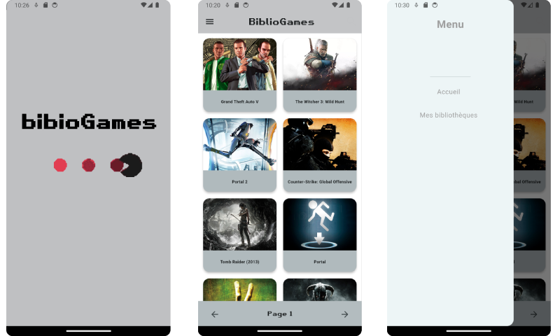
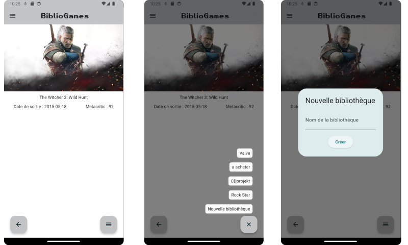
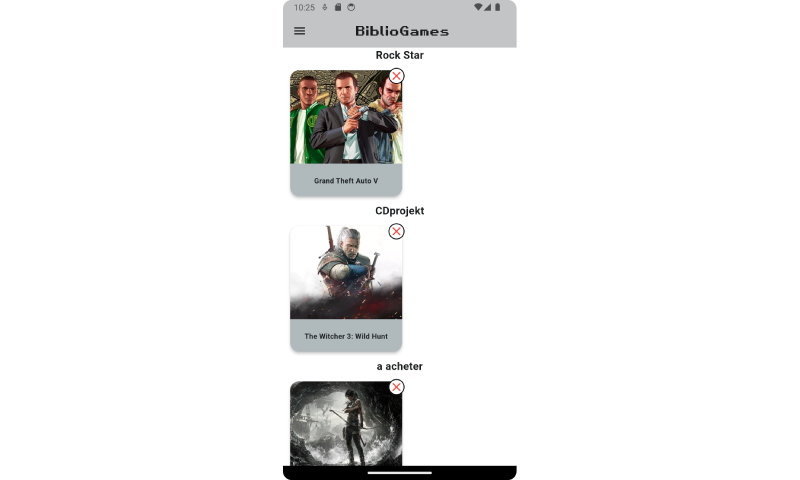

# BiblioGames

BiblioGames est une application codée en Flutter dans le cadre de mes études en BTS SIO option SLAM.
Cette application permet d'avoir sa collection de jeux sauvegarder dans son tèlephone, avec la possibilitè de créer des bibliothèques de jeux
et de voir les informations des jeux.

Cette application est le prèquel d'un plus gros projet personnel.

## Fonctionnement

L'application démarre sur un splash Screen de 3 s, on est ensuite redirigé sur la page d'accueil sur laquelle se trouvent les diffèrentts jeux et boutons pour accéder 
aux informations des jeux. Et un menu déroulant  qui amène soit à la page d'accueil ou sur la page des bibliothèques.

### Page gameInfo :

Sur la page gameInfo, vous avez accès à certaine information du jeu avec une image de celui-ci. Il y a aussi la possibilitè d'ajouter le jeu 
à une bibliothèque grâce au bouton en bas a droite de la page.

### Page MesBibliothèques :

Sur la page MesBibliothèques l'utilisateur à accès à toutes ces bibliothèques et au jeux qu'il à ajouter. Il est possible de supprimer un jeu d'une 
bibliothèque et toute les données des bibliothèques sont stocké en local.

## Les fichiers

### Dice.dart 

Dice est une classe abstraite qui sert de "modèle" pour créer des dés de nombre de faces différant comme avec les classes fille dice6, dice10... 
Elle possède 2 attributs privés _nbface qui sert à savoir le nombre de faces du dé et _resultatface qui est une variable qui sauvegarde le résultat du dé après chaque lancer.

### Dice6/10/20/100/X.dart 

Dice6/10/20/100/X sont des classes fille de Dice elles permettent la création de dé à 6/10/20/100/X faces (X étant un nombre choisi par l'utilisateur)

### Dicepool.dart

Dicepool est une classe abstraite qui sert de "modèle" pour créer des pools de dé différant comme avec les classes fille dice6pool, dice10pool...
Elle possède 2 attributs privés _pool qui est une List où sont stockés les dés et _résultat une List où sont stockés les résultats de chaque dé.

### Dice6/10/20/100/Xpool.dart 

Dice6/10/20/100/Xpool sont des classes fille de Dicepool elles permettent la création d'un pool de  dé à 6/10/20/100/X faces uniquement. (X étant un nombre choisi par l'utilisateur)
